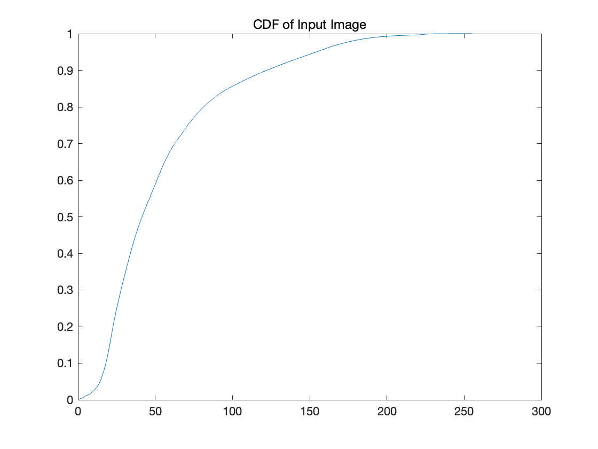
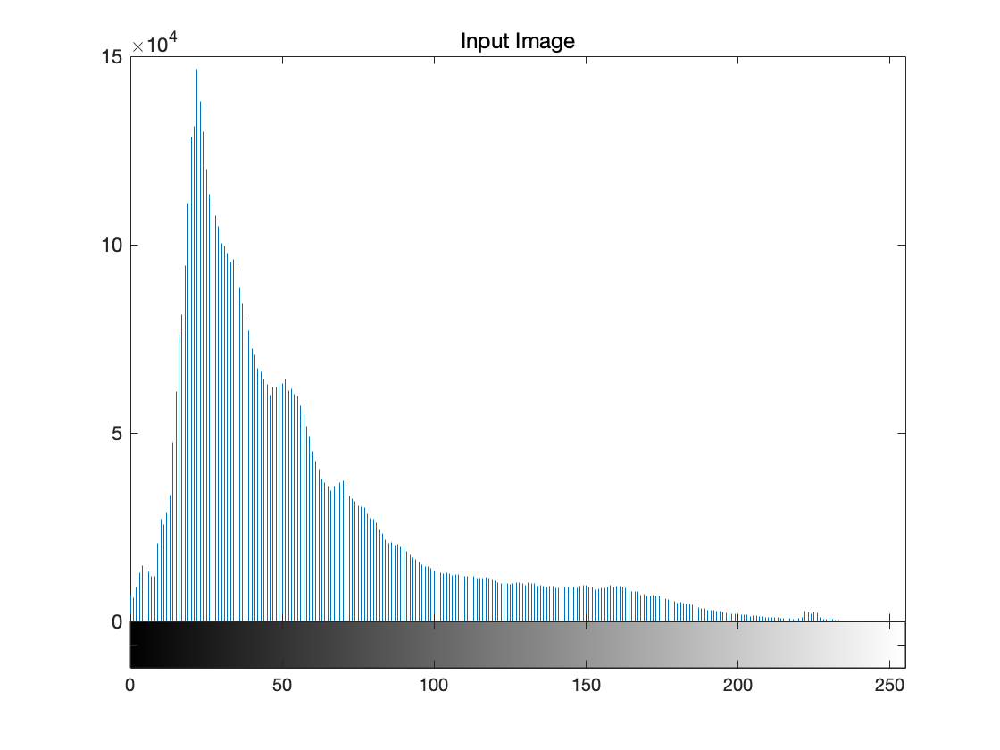
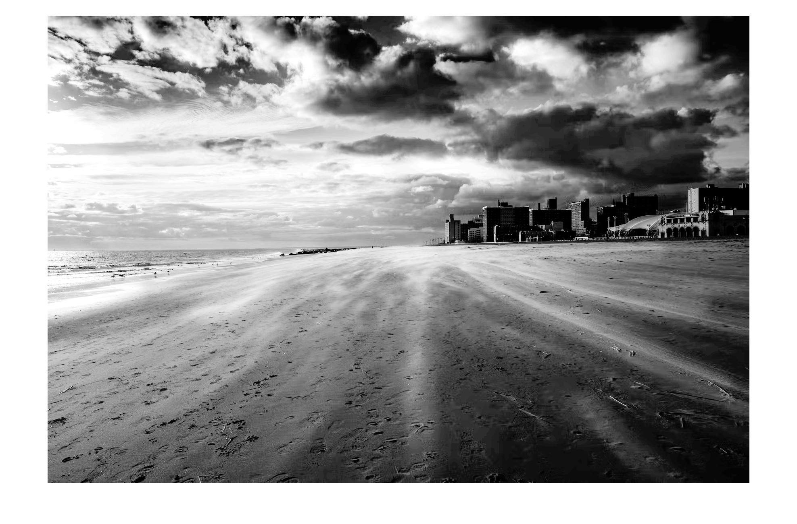
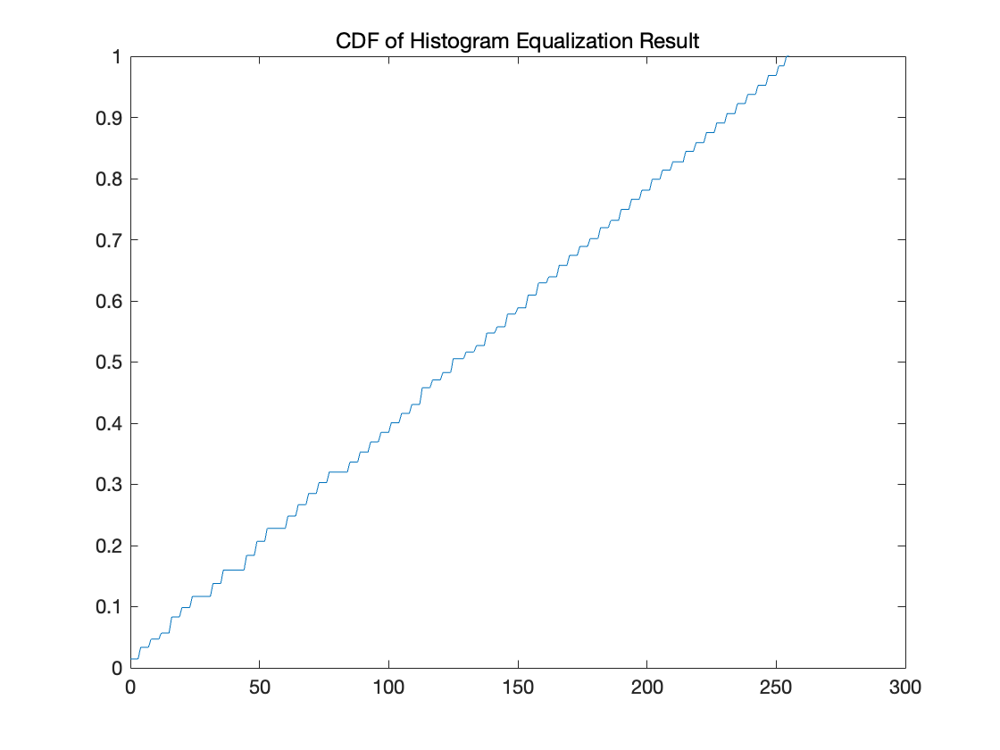
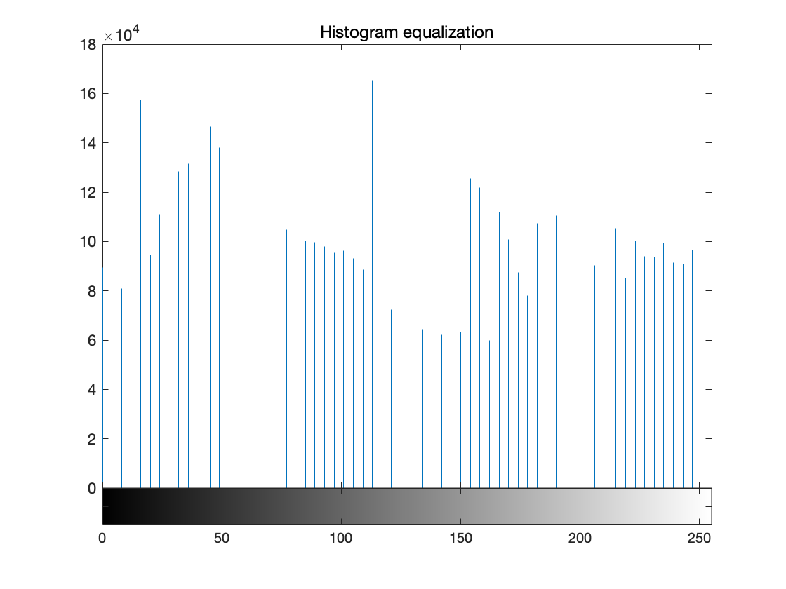
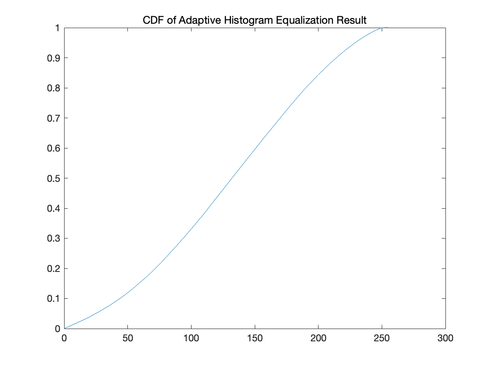
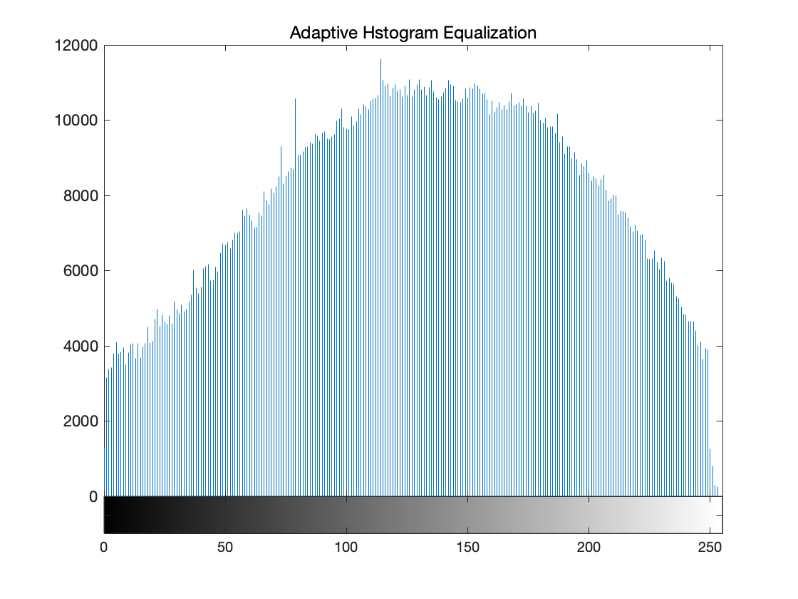

# Input 
### Test image for assignment 1 
  

### Input CDF 

### Input Histogram

# After Histogram Equalization

### CDF 

### Histogram

# After Adaptive Histogram Equalization

### CDF 

### Histogram
